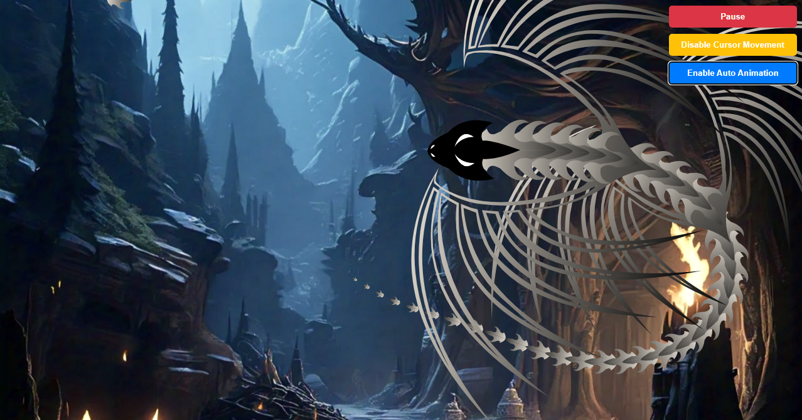

# Dragon Animation Project



## Overview

This project demonstrates a dynamic SVG-based dragon animation using React. It leverages modern React hooks like `useRef`, `useState`, and `useEffect` to create a responsive, interactive animation that reacts to user input.

## Features

- **Responsive SVG Animation**: A dragon that animates dynamically based on user input or auto-animation mode.
- **Interactive Controls**: Buttons to toggle animation, cursor movement, and auto-animation.
- **Performance Optimization**:
  - **`useRef` for Elements**: Prevents unnecessary re-renders by storing elements (`elems`) in `useRef`.
  - **Efficient Event Listeners**: Proper handling of `resize` and `pointermove` events with cleanup during unmount to prevent memory leaks.
  - **One-Time Initialization**: Elements (`elemsRef`) are initialized only once outside of `useEffect` to ensure state preservation between renders.

## Technologies Used

- **React**: For building the UI and handling state management.
- **SVG**: To render and animate vector graphics.
- **JavaScript/TypeScript**: Leveraging TypeScript for type safety and robust development.

## Code Highlights

1. **Using `useRef` for Elements**  
   `  const elemsRef = useRef<{ use: SVGUseElement | null; x: number; y: number }[]>([]);`
   <br>
2. **One-Time Initialization of Elements**

   ```
   if (elemsRef.current.length === 0) {
     for (let i = 0; i < N; i++) {
       elemsRef.current[i] = { use: null, x: window.innerWidth / 2, y: 0 };
       // Prepend elements conditionally
       if (i === 1) prepend("Cabeza", i);
       else if (i === 8 || i === 14) prepend("Aletas", i);
       else prepend("Espina", i);
     }
   }
   ```

     <br>

3. **Event Listener Cleanup**

   ```
   useEffect(() => {
     window.addEventListener("resize", resize);
     if (allowCursorMovement) {
       window.addEventListener("pointermove", pointerMoveHandler);
     }

     return () => {
       window.removeEventListener("resize", resize);
       window.removeEventListener("pointermove", pointerMoveHandler);
       cancelAnimationFrame(animationFrameIdRef.current);
     };
   }, [allowCursorMovement]);
   ```

   <br>

## Getting Started

**Prerequisites**

```
    Node.js (v14+ recommended)
    npm or yarn package manager
```

**Installation**
1- Clone the repository:

```
git clone https://github.com/RyomenDev/DragonQuest.git
```

2- Navigate to the project directory:

```
cd DragonQuest
```

3- Install dependencies:

```
npm install
```

<br>

**Run the Application**
Start the development server:

```
npm run dev
```
